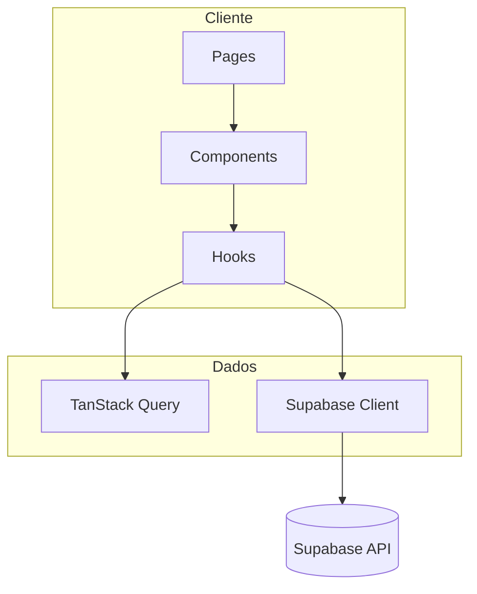

# Arquitetura

## Visão em camadas

## Rotas

| Caminho | Componente | Responsabilidade |
|---------|------------|------------------|
| `/` | `pages/Index.tsx` | Landing: composição das seções |
| `/auth` | `pages/Auth.tsx` | Login admin |
| `/admin` | `pages/Admin.tsx` | Dashboard + tabelas |
| `*` | `pages/NotFound.tsx` | 404 |

O router está em `App.tsx`, envolvido por `QueryClientProvider`, toasts e tooltips globais.

## Organização de pastas

- `src/components/` — seções da landing, modais, widgets (WhatsApp, carrossel) e `admin/` para o painel.
- `src/components/ui/` — primitives shadcn (botões, dialog, tabs, etc.).
- `src/hooks/` — `useLead`, `useDiagnostic`, `useVideos`, `use-toast`, `use-mobile`.
- `src/integrations/supabase/` — `client.ts` (cliente tipado), `types.ts` (gerados/atualizados conforme o schema).
- `src/lib/utils.ts` — utilitários (ex.: `cn` para classes).
- `supabase/` — `config.toml`, `migrations/*.sql`.

## Fluxo de dados principais

1. **Lead:** componentes chamam `useLead().saveLead`, que faz `insert` em `leads` com `source` identificando o ponto de conversão.
2. **Diagnóstico:** `DiagnosticModal` valida contato (Zod) e respostas; `useDiagnostic().saveDiagnostic` persiste em `diagnostic_results`.
3. **Vídeos:** `useVideos` (React Query) lê `videos`; URLs públicas podem vir da coluna `public_url` ou de storage, conforme preenchimento no banco.
4. **Admin:** `DashboardStats` agrega contagens; tabelas leem linhas com cliente autenticado (políticas RLS de leitura devem existir para o role apropriado no Supabase — revisar projeto em produção).

## Build e ambiente

- Prefixo **Vite:** apenas variáveis `VITE_*` são expostas ao bundle do navegador.
- Alias `@/` → `src/` (`vite.config.ts` e `tsconfig`).

## Decisões de produto refletidas no código

- Landing **pública** com inserts anônimos nas tabelas de captura (ver políticas em `SUPABASE.md`).
- **Admin** depende de **Supabase Auth**; sessão em `localStorage` via opções do client.
